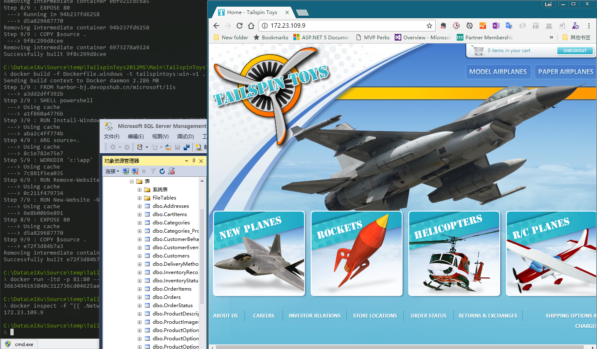

# 使用 Windows Container 运行 ASP.NET MVC 2 + SQL EXPRESS应用

上一篇Windows Container文章中给大家介绍了如何使用Windows Container运行一个传统的.net 4.5 web应用程序，当时我们使用了默认的Visual Studio模版创建了一个简单的项目，而且没有链接数据库。我相信使用.net进行应用开发的程序员们一定在想，如果我有一个很老的项目，比如使用的是asp.net mvc 3和sql server，那是否可以使用Windows Container进行部署呢？所以这次我找来了一个2010年的老项目，使用的是 asp.net mvc 2和sql server运行，这个项目已经有7年之老，应该比较有代表性了。

具体操作方式可以参考以下博客链接

[Docker4Dev #7 新瓶装老酒 – 使用 Windows Container运行ASP.NET MVC 2 + SQLExpress 应用](http://devopshub.cn/2017/02/12/d4d-7-windows-container-aspnet-mvc2-sqlexpress/)

请关注微信公众号 【devopshub】，获取更多关于DevOps研发运维一体化的信息

